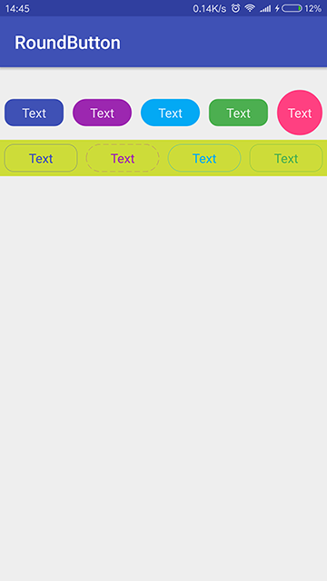

## 介绍
可设置圆角背景边框的的按钮 

通过调节色彩明度自动计算按下(pressed)状态颜色


## 引入
* groovy
```
    repositories { 
        maven { url "https://jitpack.io" }
    } 
```

* Gradle 
   
   ```
    compile 'com.github.scalling:roundbutton:1.0.0'
   ```
* Maven
	
	```
    <dependency>
      <groupId>com.github.scalling</groupId>
      <artifactId>roundbutton</artifactId>
      <version>1.0.0</version>
      <type>pom</type>
    </dependency>
	
	```
## Gradle


    
## Usage
    
**XML**

``` xml
<com.zm.rb.view.RoundButton
    style="@style/RoundButton"
    android:text="Text"
    app:btnCornerRadius="10dp" 
    app:btnSolidColor="#3F51B5"/>
    
<com.zm.rb.view.RoundButton
    style="@style/RoundButton.Two"
    android:text="Text"
    android:textColor="#3F51B5"
    app:btnCornerRadius="10dp"
    app:btnPressedRatio="1.5"
    app:btnStrokeColor="#3F51B5"/>
``` 

**属性**

``` xml 
<declare-styleable name="RoundButton">
    <!-- 背景色 -->
    <attr name="btnSolidColor" format="color"/>
    <!-- 边框色 -->
    <attr name="btnStrokeColor" format="color"/>
    <!-- 边框厚度 -->
    <attr name="btnStrokeWidth" format="dimension"/>
    <!-- 边框虚线长度 -->
    <attr name="btnStrokeDashWidth" format="dimension"/>
    <!-- 边框虚线间隙 -->
    <attr name="btnStrokeDashGap" format="dimension"/>
    <!-- 圆角半径，stadium 表示半径为 min(height,width) / 2-->
    <attr name="btnCornerRadius" format="dimension">
        <enum name="stadium" value="-1"/>
    </attr>
    <!-- 自动计算按下(pressed)状态颜色的系数, 值为0时不自动计算 -->
    <attr name="btnPressedRatio" format="float"/>
</declare-styleable>
```


## 具体用法请查看DEMO
>[activity_main.xml](https://github.com/scalling/RoundButton/blob/master/roundbuttomsample/src/main/res/layout/activity_main.xml)
 
## 混淆
没有使用到：序列化、反序列化、JNI、反射，所以并不需要添加混淆过滤代码